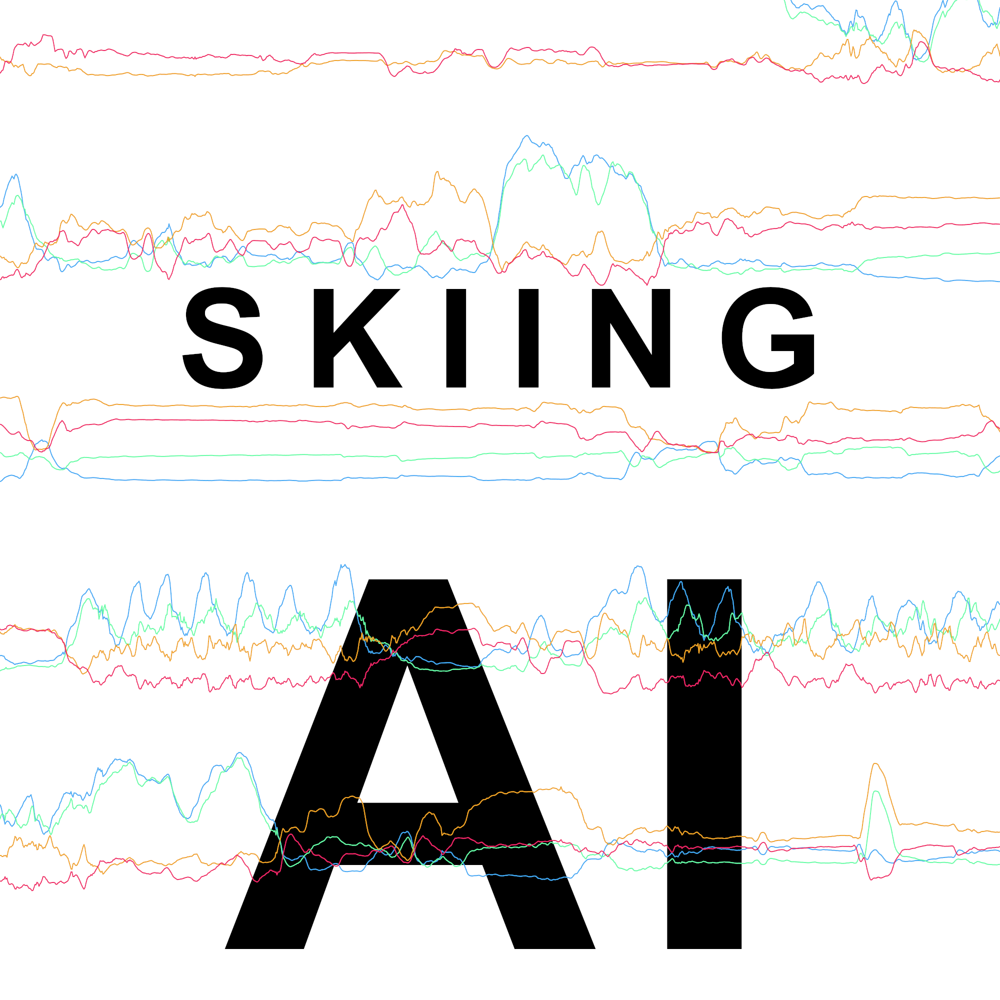

	

# Skiing-AI

View the corresponding article on my github pages site [obrhubr.github.io](https://obrhubr.github.io).

### How to get data for your own training?

Use the awesome [Sensor Logger App](https://github.com/tszheichoi/awesome-sensor-logger) that is available for both Android and iOS. Choose accelerometer, gyrometer and GPS data for logging and press start. Then hit the slopes and worry about data science later.

### How to run the project?

Create a `data` directory here, and add `train` and `test` to it. 
Then, export your data from the [Data Logger App](https://github.com/tszheichoi/awesome-sensor-logger) in `csv format`, both training and test data.
Put the zip files for each in their corresponding directories, renaming the files to `data.zip`.

First, open `data_wrangle.ipynb` and run the scripts to extract the data and reshape it. To label it, use `data_label.ipynb`, making sure to correctly edit the `json` object containing the labels with your own data. Then use `data_prepare.ipynb` to create an actual dataset.

You should now have multiple files called `train_100.csv` and `train_quat_400.csv` in your data folders. To train your model on them, use the notebook `model_train.ipynb`, making sure to load the right dataset with the right values for `channel` and `datapoints` (6 channels if you use 6 features from the sensors, 400 datapoints if you choose `train_400.csv` for example).

To get the predictions, use `model_predict.ipynb`.

All other notebooks were experiments used to optimise the model.